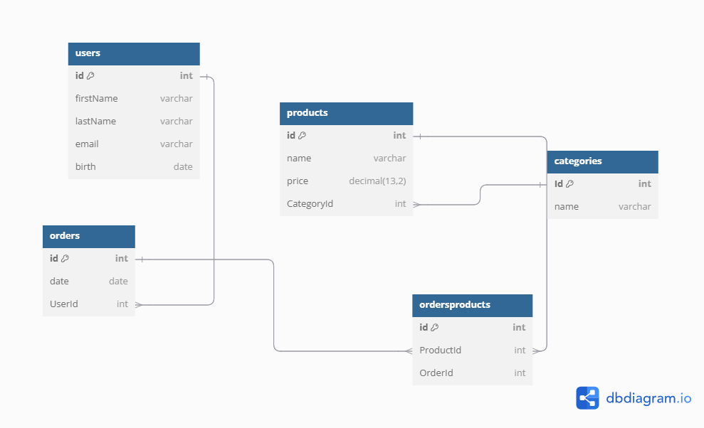

Documentación del Proyecto
Descripción General
Este proyecto es una API REST desarrollada con Node.js que incluye módulos para gestionar categorías, pedidos y usuarios. Además, cuenta con funcionalidades para migraciones, modelos, rutas y seeders para inicializar la base de datos.

Estructura
Controladores
1. CategoryController
Gestiona las categorías de productos.

Endpoints:
POST /categories: Crear una nueva categoría.
GET /categories: Obtener todas las categorías.
GET /categories/:id: Obtener una categoría específica por ID.
PUT /categories/:id: Actualizar una categoría por ID.
DELETE /categories/:id: Eliminar una categoría por ID.
GET /categories/filter: Filtrar categorías por nombre utilizando un parámetro de consulta.
Características Clave:
Utiliza Sequelize para las operaciones con la base de datos.
Implementa manejo de errores en todas las operaciones.
Soporta filtrado dinámico con Op.like.
2. OrderController
Gestiona los pedidos y su relación con los productos.

Endpoints:
POST /orders: Crear un nuevo pedido.
GET /orders: Obtener todos los pedidos, incluyendo detalles de los productos relacionados.
Características Clave:
Incluye información de los productos asociados a cada pedido.
Manejo robusto de errores.
3. UserController
Gestiona la autenticación y las operaciones de usuarios.

Endpoints:
POST /users: Crear un nuevo usuario (con contraseñas encriptadas).
POST /users/login: Autenticar un usuario y generar un token JWT.
POST /users/logout: Invalidar el token de un usuario.
GET /users/info: Obtener detalles del usuario autenticado, incluyendo pedidos y productos asociados.
Características Clave:
Usa bcrypt para encriptar contraseñas.
Genera y almacena tokens JWT para la autenticación.
Integra información de pedidos y productos asociados al usuario.
Estructura General del Proyecto
Modelos: Representan las entidades de la base de datos.
Rutas: Definen los puntos de acceso de la API y vinculan las rutas con los controladores.
Migraciones: Manejan los cambios en la estructura de la base de datos.
Seeders: Inicializan la base de datos con datos predefinidos.
Instalación
Clonar el repositorio:
bash
Copiar código
git clone <URL-del-repositorio>
Instalar las dependencias:
bash
Copiar código
npm install
Configurar el archivo config.json en el directorio config con los datos de conexión a la base de datos.
Ejecutar las migraciones para inicializar la base de datos:
bash
Copiar código
npx sequelize db:migrate
Cargar los datos iniciales (seeders):
bash
Copiar código
npx sequelize db:seed:all
Uso
Iniciar el servidor:
bash
Copiar código
npm start
Acceder a la API en http://localhost:<puerto-configurado>.
Dependencias Principales
Sequelize: ORM para gestionar la base de datos.
bcryptjs: Encriptación de contraseñas.
jsonwebtoken: Generación y validación de tokens JWT.
Express: Framework para gestionar las rutas y middleware.
Autores
Desarrollado por [Luis].
